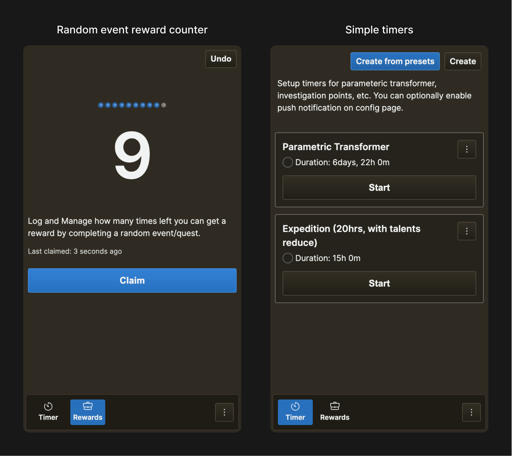

# genshin-utils

My personal utility application for Genshin Impact.
Built as PWA, primarily designed for mobile usage.



## Development

Requires Node.js LTS (asdf or nvm preferred) with corepack enabled.

```sh
# Install development dependencies
$ pnpm i

# Run locally, default on http://localhost:3000
$ pnpm dev

# Run UI catalogue, default on http://localhost:3000
$ pnpm adw:showcase

# Run tests
$ pnpm test
```

## Data sources

### Translation files

Translation files reside in `src/translations/<locale>.json`. Missing translation keys would fallback to `en-GB`.
For keys structure, see `en-GB.json` as a reference.

### Genshin servers

Stored in `src/servers.json`.

| Property    | Type     | Description                                                                         |
| ----------- | -------- | ----------------------------------------------------------------------------------- |
| `id`        | `string` | Used to identify the server. Should be unique among servers. Should not be changed. |
| `name`      | `string` | Display name.                                                                       |
| `tzOffset`  | `number` | Time zone offset from UTC in hours.                                                 |
| `shortName` | `string` | Required for legacy reasons. Maybe removed in the future.                           |

### Timer presets

Stored in `src/timerPresets.json`.

At least one of `duration.minute`, `duration.hour`, or `duration.day` must be present.
Also, the resulting duration must be greater than a minute.

| Property          | Type     | Description                                                                      |
| ----------------- | -------- | -------------------------------------------------------------------------------- |
| `name.default`    | `string` | Name in en-GB. Also used as a fallback.                                          |
| `name.<locale>`   | `string` | Name in the `locale`. Missing translation would fallback to `default` (`en-GB`). |
| `duration.day`    | `number` | How many days will the timer run?                                                |
| `duration.hour`   | `number` | How many hours will the timer run?                                               |
| `duration.minute` | `number` | How many minutes will the timer run?                                             |
